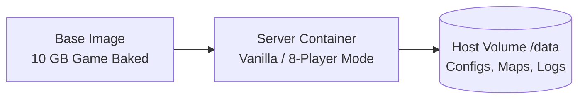

<div align="center">

# Left 4 Dead 2 Dedicated Server

**Left 4 Dead 2 Linux dedicated server container with 8-player co-op support and instant boot times.**

[](https://github.com/Delnegend/l4d2-server-container/actions)
[](https://github.com/Delnegend/l4d2-server-container/releases)
[](LICENSE)

</div>

---

## Quick Start

Get your server running in less than 60 seconds:

```bash
# 1. Download configuration
curl -fsSL https://raw.githubusercontent.com/Delnegend/l4d2-server-container/main/compose.yaml -o compose.yaml

# 2. Start the server
podman compose up -d

# 3. View startup logs
podman compose logs -f
```

Look for `Self-check OK: server answers A2S queries` in the log to confirm the server is public and discoverable.

## Highlights

- **Instant startup** — The ~10 GB game install is baked into the base image layer, booting within seconds without runtime downloads.
- **8-Player co-op out of the box** — Pre-configured with SourceMod, MetaMod, l4dtoolz, and the 5+ survivor plugin stack.
- **Clean host storage** — Game files stay read-only in the image; your host volume only stores ~50 MB of configs, maps, and logs.
- **Flexible server modes** — Set `SERVER_MODE` to `8players` (default), `sourcemod` (4-player with admin tools), or `vanilla` (pure 4-player stock server).
- **Unprivileged security** — Runs safely as standard non-root user `steam` (UID 1000) with automatic visibility self-checks.

## Common Options

Configure the server by passing environment variables in `.env` or your container manager:

| Variable | Default | Description |
|---|---|---|
| `SERVER_NAME` | `Left 4 Dead 2 Dedicated Server` | Server display name in the browser |
| `RCON_PASSWORD` | `ChangeThisRconPassword123` | Administrative remote console password |
| `DEFAULT_MAP` | `c1m1_hotel` | Starting campaign map |
| `SERVER_MODE` | `8players` | Server mode: `8players`, `sourcemod`, or `vanilla` |
| `STEAM_GROUP_ID` | `""` | Steam Group ID to advertise server to members |

For the complete variable list, config file precedence, and custom maps, see **[Configuration Reference](docs/configuration.md)**.

## Architecture



For build stages, layer caching strategy, and runtime symlink joining, see **[Architecture Guide](docs/architecture.md)**.

## Documentation

- **[Architecture](docs/architecture.md)** — Multi-stage build graph, cache optimization, and volume symlinking.
- **[Configuration](docs/configuration.md)** — Environment variables, config precedence, and custom map setups.
- **[8-Player Co-op](docs/eight-players.md)** — How l4dtoolz, left4dhooks, and survivor slots work.
- **[Modding](docs/mods.md)** — Adding plugins, campaign VPKs, and volume persistence rules.
- **[Troubleshooting](docs/troubleshooting.md)** — Diagnosing A2S discovery issues, rejected flags, and boot errors.
- **[Maintenance](docs/maintenance.md)** — Upstream updates, image builds, and release workflows.

## License

[MIT](LICENSE)
