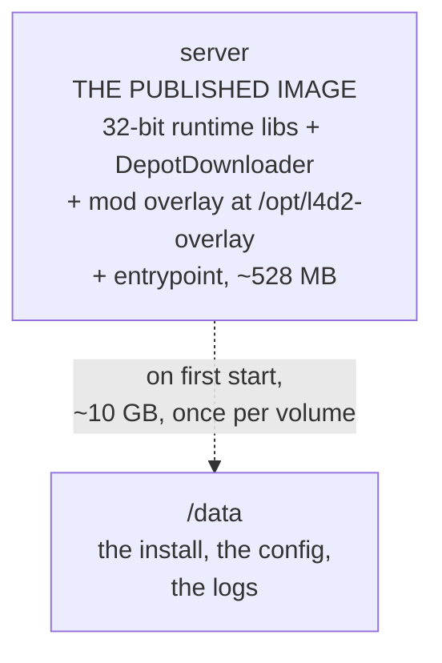

# Architecture

How the image is built, how the install lands on the volume, and what each layer
costs. For configuration see [configuration.md](configuration.md); for the
4-survivor cap see [eight-players.md](eight-players.md).

## The build graph

One stage, one published image, and none of Valve's 10 GB inside it.



| Stage | Published? | What it adds |
|---|---|---|
| `server` | **yes** | The 32-bit runtime libraries, DepotDownloader, MetaMod:Source + SourceMod (1.12), l4dtoolz, Left 4 DHooks, the 5+ survivor plugins, the entrypoint, `server.cfg.template` and the image-level cvars. |

There is no second stage, so a bare `podman build .` produces it with no
`--target`.

### Why the game is not in the image

Valve's dedicated server is ~10 GB and Valve ships a new build every few weeks.
Carrying it in the image meant a 10.3 GB pull for a deployment and an 8-minute
CI build for every release, so a Valve patch became an infrastructure event.

Leaving it out costs exactly one thing: the first start of a volume downloads
the pinned depot manifest, ~10 GB, once. Every later start reuses it, because
the volume is the install.

The pin is `GAME_MANIFEST`, a Steam depot manifest id rather than a build
number, so two runs that resolve it to the same value fetch byte-identical
files. It is a build *argument* rather than a constant, which means a
deployment can move to a newer Valve build by setting `GAME_MANIFEST` in `.env`
— no image build, no image pull.

### The mod overlay

Our `addons/` and `cfg/` are staged in the image at `/opt/l4d2-overlay`,
mirroring the `left4dead2/` layout, and the entrypoint copies them over the
downloaded install on every start.

Staging them rather than writing straight into an install is what lets the
install be replaced wholesale when the manifest changes without losing the mod
stack. It also gives the two directories different merge rules, because one of
them belongs to us and the other to you:

| Directory | Rule | Why |
|---|---|---|
| `addons/` | overwritten | MetaMod, SourceMod, l4dtoolz and the 5+ plugins are ours, and an image update has to reach a volume that already has the right game build. |
| `cfg/` | **no-clobber** | `server_custom.cfg`, `sourcemod.cfg` and `l4dmultislots.cfg` are yours. A seed that only fills in what is missing cannot overwrite a tuned file. |

Applying it costs ~209 MB of copying per start, which is seconds next to a boot
that already takes the better part of a minute.

### Layer sizes (measured)

| Image | Size | Adds |
|---|---|---|
| `server` | 528 MB | 81 MB Debian + 130 MB 32-bit runtime libraries + 209 MB mod overlay + ~108 MB DepotDownloader and tools |

The install is not in it, and that accounts for essentially all of the size:
it would otherwise add 9.82 GB.

`linux64/` is removed from the MetaMod modules: the engine is a 32-bit build, and
the 64-bit module only produces dlopen noise
(`Unable to load plugin "addons/metamod/bin/linux64/server"`, which is expected).

## Compression

The published image is pushed with **zstd level 4**
(`outputs: type=image,compression=zstd,compression-level=4`), which is the
setting that matters: it is the registry blobs that consumers download. The
`just push` recipe passes the same two flags to `podman push`.

This only affects the push. Layers in podman's local overlay store keep the
container's own default format, so `podman images` reports a local size that is
not the same thing as the transferred size.

Anything that pulls the image needs a runtime that understands zstd layers —
containerd 1.7+, Docker 20.10+, podman 3+. If that ever stops being true, the
fallback is `compression=gzip` in the workflow and
`L4D2_COMPRESSION=gzip just push`.

## The download

DepotDownloader 3.4.0 handles Valve's `freetodownload` flow anonymously, which
SteamCMD cannot (see the README). It runs from the published image, on the
first start of a volume, and makes **two** passes:

| Depot | Files | What it is | Pinned by |
|---|---|---|---|
| `222863` | 674 | the launcher — `srcds_run`, `srcds_linux` | `LAUNCHER_MANIFEST` |
| `222861` | 116 977 | the game — `left4dead2/`, `bin/`, `platform/` | `GAME_MANIFEST` |

DepotDownloader takes a single `-depot` per run, so the two write disjoint
paths in sequence. The launcher goes first because it is small and finishes in
seconds, which turns a stale pin into an immediate failure rather than one
discovered ten minutes later.

`MAX_DOWNLOADS` (default 16) is DepotDownloader's `-max-downloads`: how many
manifest chunks are fetched concurrently. The tool's own default is 8.

The download lands in `.l4d2-install/` **inside the volume**, not in a tmpfs,
so swapping it into place is a rename per top-level entry rather than a second
10 GB copy, and an interrupted download can never be mistaken for a finished
one. The tool's `.DepotDownloader/` bookkeeping is removed before the swap.

## Build arguments

| Argument | Default | Effect |
|---|---|---|
| `GAME_MANIFEST` | `48279775…` | Depot 222861 manifest: the game, 116 977 files, ~9.5 GB. What the entrypoint downloads on the first start of a volume, and the single value that decides whether it downloads at all. Override per deployment with `GAME_MANIFEST` in `.env`. |
| `LAUNCHER_MANIFEST` | `86824416…` | Depot 222863 manifest: 674 files, `srcds_run` and `srcds_linux`. Steam versions this depot independently of the game one, so it needs its own pin — pinning only `GAME_MANIFEST` would leave the server binary unpinned. |
| `APP_ID` | `222860` | Steam app the dedicated server is published under. |
| `GAME_DEPOT` | `222861` | The linux dedicated server depot. |
| `LAUNCHER_DEPOT` | `222863` | The launcher depot. The SDK depot is never selected: `-os linux` does not pick it. |
| `MAX_DOWNLOADS` | `16` | Concurrent depot chunks. Higher saturates a faster uplink. |
| `SOURCEMOD_BRANCH` | `1.12` | AlliedModders release branch for **both** MetaMod:Source and SourceMod. |
| `L4DTOOLZ_VERSION` / `L4DTOOLZ_BUILD` | `2.5.1` / `2155` | Which l4dtoolz release goes into the overlay. |
| `LEFT4DHOOKS_SHA256` | `1536aac3…` | Checksum the vendored `assets/left4dhooks.zip` against. The build fails if it does not match. |
| `L4D_PLUGINS_REF` | `3494e478…` | Commit of [fbef0102/L4D1_2-Plugins](https://github.com/fbef0102/L4D1_2-Plugins) the 5+ plugins are fetched from, so a rebuild gets the same bytes. |
| `DEPOT_DOWNLOADER_VERSION` | `3.4.0` | DepotDownloader release to ship in the image. |
| `SERVER_VERSION` | `dev` | Stamped as `org.opencontainers.image.version`. |
| `DEBIAN_IMAGE` | `debian:trixie-slim` | Base distribution. |

`SOURCEMOD_BRANCH=1.12` is sourcemod.net's **stable** channel — its dev channel
is 1.13, and the 1.11 line is kept as a legacy branch. It is also what the
5+/8-player plugins are compiled against; see
[eight-players.md](eight-players.md).

`GAME_MANIFEST`, `LAUNCHER_MANIFEST`, `L4DTOOLZ_VERSION`, `L4DTOOLZ_BUILD` and
`L4D_PLUGINS_REF` are the five the update workflow rewrites; see
[maintenance.md](maintenance.md#automated-update-checks).

## The install and the volume

Everything is on the volume. `/data` is the volume and stays the server's
working directory — the layout the engine, the config paths and every admin tool
already expect.

```text
/data/                          downloaded on the first start, then reused
├── .l4d2-manifest             which manifest produced this install
├── srcds_run                  from the depot
├── bin/                       from the depot
├── left4dead2/                from the depot
│   ├── cfg/                   yours, and the one thing that survives
│   │   │                          a manifest change
│   ├── addons/                ours, overwritten on every start
│   ├── maps/                  drop workshop maps here
│   └── scripts/               custom campaign definitions
└── console.log                the server log
```

There are no symlinks and nothing is copied out of the image except the 209 MB
mod overlay.

### Rules the install follows

- **`left4dead2/.l4d2-manifest` is the whole state machine.** If it matches
  `GAME_MANIFEST` and `srcds_run` is there, the volume is left completely alone.
- **A different manifest replaces the install wholesale.** It is not merged: a
  manifest describes a whole depot, and a half-old, half-new install is not a
  state this can reach.
- **`left4dead2/cfg` survives a manifest change.** It is parked beside the
  staging tree before the swap and put back after, because the engine and
  SourceMod write into it and `server_custom.cfg` lives there.
- **`addons/` does not survive a manifest change, but it does not need to.** The
  overlay is applied on every start, not only after a download.

### One engine quirk worth knowing

The engine resolves `exec` (as in `exec somefile.cfg`) against the **install
root** — the directory holding the `srcds_run` binary, which is now on the
volume rather than in the image. `server.cfg.template` does not use `exec`
anyway, so nothing changes; see
[configuration.md](configuration.md#config-file-precedence).

## Runtime

The entrypoint runs as the unprivileged `steam` user (UID 1000), which owns
`/data` and writes the install itself. It links `steamclient.so` into
`~/.steam/sdk32` for the Valve API, then `exec`s `srcds_run` so the engine is
PID 1 and receives signals directly. Under Kubernetes the `data` volume must be
writable by UID 1000; the reference deployment uses `userns_mode: keep-id` with
`user: 1000:1000`.

Verified against L4D2 depot manifest `4827977561765481436`.
