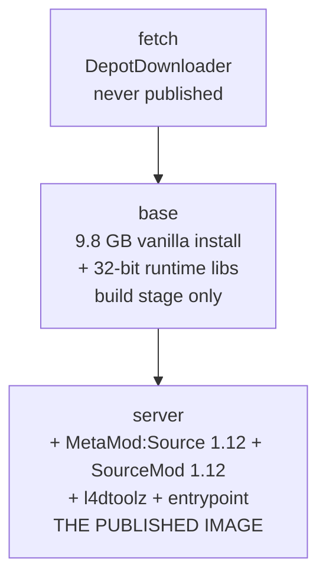

# Architecture

How the image is built, how the volume is joined to it, and what each layer
costs. For configuration see [configuration.md](configuration.md); for the
4-survivor cap see [eight-players.md](eight-players.md).

## The build graph



| Stage | Published? | What it adds |
|---|---|---|
| `fetch` | no target | DepotDownloader plus the download. Anonymous login, linux depot set. Exists so the downloader never enters a published image. |
| `base` | no, build stage only | The 32-bit runtime libraries and the install, byte for byte as DepotDownloader wrote it. No entrypoint, no configuration, no mods. |
| `server` | **yes** | `base` plus MetaMod:Source + SourceMod (1.12), l4dtoolz, the entrypoint, `server.cfg.template` and the image-level cvars. |

`server` is the last stage, so `podman build .` produces it with no `--target`.

### Why `base` is a stage and not an image

Two reasons, both practical:

- **Provenance.** Everything in the published image can be attributed to a layer
  that touches nothing of Valve's content. `base` is the line between "what
  Valve shipped" and "what we added".
- **Cache.** It is the only reason a rebuild after an edit to `entrypoint.sh` or
  `server.cfg.template` costs seconds instead of re-downloading 10 GB. Because
  the two layers are separate, the expensive one stays put.

It is not published, so nothing deploys it and it costs no extra registry blobs:
its layers ship anyway, as the parents of `server`.

### Layer sizes (measured)

| Image | Size | Adds |
|---|---|---|
| `base` | 10.0 GB | 9.82 GB install + 130 MB 32-bit runtime libraries + 81 MB Debian |
| `server` | 10.3 GB | +214 MB and 14 MB MetaMod:Source + SourceMod, +114 kB l4dtoolz, +40 kB config and entrypoint |

Two ownership details in that table are deliberate, and both were measured the
hard way:

- The install is copied with `COPY --from=fetch --chown=steam:steam` instead of
  being copied and then `chown -R`'d. A recursive chown restamps the metadata of
  every one of the ~90 000 files, which the layer store writes as a **second
  10 GB layer** — it made the image 19.9 GB rather than 10.0 GB. The `steam`
  user is therefore created *before* the install lands.
- The `server` stage chowns only what the archives touched, plus
  `left4dead2/cfg` **by name**: the SourceMod tarball carries its own `cfg/`
  entry, and extracting it as root hands that directory back to root. Everything
  under `/opt/l4d2` ends up steam-owned, which is what lets the server run
  unprivileged.

`linux64/` is removed from the MetaMod modules: the engine is a 32-bit build, and
the 64-bit module only produces dlopen noise
(`Unable to load plugin "addons/metamod/bin/linux64/server"`, which is expected).

## Compression

The published image is pushed with **zstd level 4**
(`outputs: type=image,compression=zstd,compression-level=4`), which is the
setting that matters: it is the registry blobs that consumers download. The
`just push` recipe passes the same two flags to `podman push`.

This only affects the push. Layers in podman's local overlay store keep the
container's own default format, so `podman images` reports a local size that is
not the same thing as the transferred size.

Anything that pulls the image needs a runtime that understands zstd layers —
containerd 1.7+, Docker 20.10+, podman 3+. If that ever stops being true, the
fallback is `compression=gzip` in the workflow and
`L4D2_COMPRESSION=gzip just push`.

## The download

DepotDownloader 3.4.0 handles Valve's `freetodownload` flow anonymously, which
SteamCMD cannot (see the README). Two depots, `222861` (server binaries, ~4.7 GB
compressed) and `222863` (content), are pulled with `-max-downloads`.

`MAX_DOWNLOADS` (default 16) is that flag: it sets how many manifest chunks are
fetched concurrently. The tool's own default is 8.

```bash
just build                                   # or: podman build -t l4d2:dev .
MAX_DOWNLOADS=32 just build
```

The tool drops a `.DepotDownloader/` bookkeeping directory *inside the install*,
not into the working directory, so the fetch stage removes it explicitly.

## Build arguments

| Argument | Default | Effect |
|---|---|---|
| `MAX_DOWNLOADS` | `16` | Concurrent depot chunks. Higher saturates a faster uplink. |
| `SOURCEMOD_BRANCH` | `1.12` | AlliedModders release branch for **both** MetaMod:Source and SourceMod. |
| `L4DTOOLZ_VERSION` / `L4DTOOLZ_BUILD` | `2.5.1` / `2155` | Which l4dtoolz release is baked in. |
| `SERVER_VERSION` | `dev` | Stamped as `org.opencontainers.image.version`. |
| `DEBIAN_IMAGE` | `debian:trixie-slim` | Base distribution. |

`SOURCEMOD_BRANCH=1.12` is sourcemod.net's **stable** channel — its dev channel
is 1.13, and the 1.11 line is kept as a legacy branch. It is also what the
5+/8-player plugins are compiled against; see
[eight-players.md](eight-players.md).

## The image and the volume

The install lives at `/opt/l4d2` **in the image**. `/data` is the volume and
stays the server's working directory — the layout the engine, the config paths
and every admin tool already expect. The two are joined at start-up by a farm
of symlinks, so nothing is ever copied.

```text
/data/                          what the server and you write to
├── srcds_run            -> /opt/l4d2/srcds_run
├── bin/                 -> /opt/l4d2/bin
├── left4dead2/          real directory, contents linked
│   ├── cfg/             real, contents linked  (server.cfg, server_custom.cfg)
│   ├── addons/          real, contents linked  (sourcemod, metamod, l4dtoolz)
│   ├── maps/            real, contents linked  (drop workshop maps here)
│   └── scripts/         real, contents linked  (custom campaign definitions)
└── console.log          real file
```

Everything only read is a symlink into the image. Measured: **~1 MB on the
volume** against a 10 GB image.

### Rules the farm follows

- **Real entries always win.** A real file or directory in `/data` is never
  replaced by a link. This is what makes an old volume — one holding a full
  install downloaded by a previous image — keep working untouched; it only gains
  links for whatever the image adds.
- **Dangling links are pruned.** If a newer image dropped a file, the link is
  removed instead of being left pointing at nothing.
- **The farm is idempotent and runs on every start.** Directories that need to
  accept new files are created as real directories *before* their contents are
  linked; skipping that step writes the links into the image instead of the
  volume.
- **Writes never go through a link.** The writable set is explicit, because a
  write through a symlink lands in the container filesystem and is lost on the
  next restart: directories `left4dead2/{cfg,addons,maps,scripts}` plus the
  files `motd.txt`, `mapcycle.txt`, `missioncycle.txt`, `maplist.txt` and
  `console.log`.

### Upgrading from a pre-split image

Nothing to do. Files already in the volume keep their real state; the image's
new files appear beside them as links. If you want the space back, delete what
you no longer need from the volume — the copy in the image is authoritative for
read-only game content.

### One engine quirk worth knowing

The engine resolves `exec` (as in `exec somefile.cfg`) against the **install
root** — the real path of the `srcds_run` binary, which is inside the image. A
file on the volume can therefore never be reached by `exec`, which is why
`server.cfg.template` does not use it. See
[configuration.md](configuration.md#config-file-precedence).

## Runtime

The entrypoint runs as the unprivileged `steam` user (UID 1000), which owns both
`/opt/l4d2` and `/data`. It links `steamclient.so` into `~/.steam/sdk32` for
the Valve API, then `exec`s `srcds_run` so the engine is PID 1 and receives
signals directly. Under Kubernetes the `data` volume must be writable by UID
1000; the reference deployment uses `userns_mode: keep-id` with `user: 1000:1000`.

Verified against L4D2 build 10097 (`version` from the engine log).
