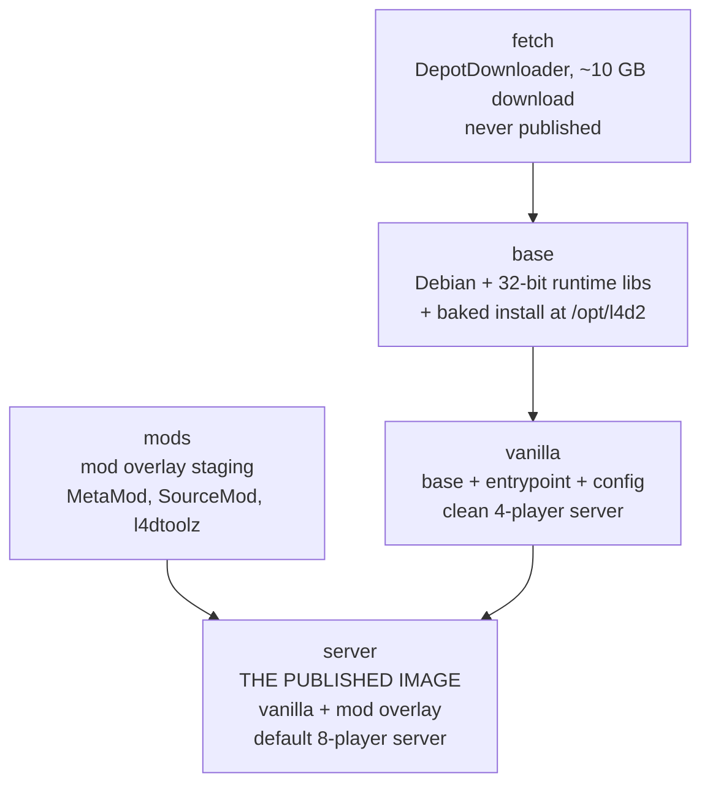

# Architecture

How the image is built, how the install lands on the volume, and what each layer
costs. For configuration see [configuration.md](configuration.md); for the
4-survivor cap see [eight-players.md](eight-players.md).

## The build graph

Multi-stage build with the game baked into the base image layer, heavily optimized for Docker layer caching.



| Stage | Published? | What it adds |
|---|---|---|
| `fetch` | no | One-shot DepotDownloader stage that downloads the pinned Steam depots into `/opt/l4d2`. |
| `base` | no | 32-bit runtime libraries, `steam` user, and the clean vanilla game install baked in at `/opt/l4d2`. |
| `mods` | no | Stages the 8-player mod overlay (MetaMod, SourceMod 1.12, l4dtoolz, Left 4 DHooks, 5+ plugins) at `/opt/l4d2-overlay`. |
| `vanilla` | no | Inherits from `base`, adds entrypoint and configuration template (clean 4-player server). Deployable via `--target vanilla`. |
| `server` | **yes** | Inherits from `vanilla`, adds the staged mod overlay from `mods` and `server_custom.cfg` (published default 8-player server). |

Building `--target vanilla` produces a pure unmodded 4-player server. Building without `--target` builds `server`, which is the published default 8-player image.

### Why the game is in the image

Baking the ~10 GB game install into the `base` stage eliminates the 10-minute download on the first run of a volume, prevents data duplication on the host drive, and allows running pure vanilla and 8-player instances from the exact same base files without cross-contamination.

Docker layer caching is optimized by separating concerns into independent stages:
- **`fetch`**: Downloads the game into `/opt/l4d2` and uses a cache mount for depot chunks.
- **`base`**: Copies `/opt/l4d2` once. Because it does not contain entrypoint scripts or configs, this ~10 GB layer remains permanently cached.
- **`mods`**: Stages all plugins independently. Rebuilding after an entrypoint or config change takes under a second because neither `base` nor `mods` needs to re-run.

### The mod overlay

Our `addons/` and `cfg/` are staged in the image at `/opt/l4d2-overlay`, mirroring the `left4dead2/` layout. When the server boots (and `SERVER_MODE` is not `vanilla`), the entrypoint links the mod stack into the server directory:

| Directory | Rule | Why |
|---|---|---|
| `addons/` | linked from image overlay | MetaMod, SourceMod, l4dtoolz and the 5+ plugins are ours. When `SERVER_MODE=vanilla`, these links are removed so the server is 100% vanilla. |
| `cfg/` | **no-clobber** | `server_custom.cfg`, `sourcemod.cfg` and `l4dmultislots.cfg` are yours. A seed that only fills in what is missing cannot overwrite a tuned file. |

### Layer sizes (measured)

| Image | Size | Adds |
|---|---|---|
| `server` | ~10.5 GB | 81 MB Debian + 130 MB 32-bit runtime libraries + 9.82 GB baked game install + 209 MB mod overlay |

`linux64/` is removed from the MetaMod modules: the engine is a 32-bit build, and
the 64-bit module only produces dlopen noise
(`Unable to load plugin "addons/metamod/bin/linux64/server"`, which is expected).

## Compression

The published image is pushed with **zstd level 4**
(`outputs: type=image,compression=zstd,compression-level=4`), which is the
setting that matters: it is the registry blobs that consumers download. The
`just push` recipe passes the same two flags to `podman push`.

This only affects the push. Layers in podman's local overlay store keep the
container's own default format, so `podman images` reports a local size that is
not the same thing as the transferred size.

Anything that pulls the image needs a runtime that understands zstd layers —
containerd 1.7+, Docker 20.10+, podman 3+. If that ever stops being true, the
fallback is `compression=gzip` in the workflow and
`L4D2_COMPRESSION=gzip just push`.

## The download

DepotDownloader 3.4.0 handles Valve's `freetodownload` flow anonymously in the `fetch` stage:

| Depot | Files | What it is | Pinned by |
|---|---|---|---|
| `222863` | 674 | the launcher — `srcds_run`, `srcds_linux` | `LAUNCHER_MANIFEST` |
| `222861` | 116 977 | the game — `left4dead2/`, `bin/`, `platform/` | `GAME_MANIFEST` |

DepotDownloader takes a single `-depot` per run, so the two write disjoint
paths in sequence. The launcher goes first because it is small and finishes in
seconds, which turns a stale pin into an immediate failure rather than one
discovered ten minutes later.

`MAX_DOWNLOADS` (default 16) is DepotDownloader's `-max-downloads`: how many
manifest chunks are fetched concurrently. The tool's own default is 8.

## Build arguments

| Argument | Default | Effect |
|---|---|---|
| `GAME_MANIFEST` | `48279775…` | Depot 222861 manifest: the game, 116 977 files, ~9.5 GB. What the entrypoint downloads on the first start of a volume, and the single value that decides whether it downloads at all. Override per deployment with `GAME_MANIFEST` in `.env`. |
| `LAUNCHER_MANIFEST` | `86824416…` | Depot 222863 manifest: 674 files, `srcds_run` and `srcds_linux`. Steam versions this depot independently of the game one, so it needs its own pin — pinning only `GAME_MANIFEST` would leave the server binary unpinned. |
| `APP_ID` | `222860` | Steam app the dedicated server is published under. |
| `GAME_DEPOT` | `222861` | The linux dedicated server depot. |
| `LAUNCHER_DEPOT` | `222863` | The launcher depot. The SDK depot is never selected: `-os linux` does not pick it. |
| `MAX_DOWNLOADS` | `16` | Concurrent depot chunks. Higher saturates a faster uplink. |
| `SOURCEMOD_BRANCH` | `1.12` | AlliedModders release branch for **both** MetaMod:Source and SourceMod. |
| `L4DTOOLZ_VERSION` / `L4DTOOLZ_BUILD` | `2.5.1` / `2155` | Which l4dtoolz release goes into the overlay. |
| `LEFT4DHOOKS_SHA256` | `1536aac3…` | Checksum the vendored `assets/left4dhooks.zip` against. The build fails if it does not match. |
| `L4D_PLUGINS_REF` | `97c5687c…` | Commit of [fbef0102/L4D1_2-Plugins](https://github.com/fbef0102/L4D1_2-Plugins) the 5+ plugins are fetched from, so a rebuild gets the same bytes. |
| `DEPOT_DOWNLOADER_VERSION` | `3.4.0` | DepotDownloader release to ship in the image. |
| `SERVER_VERSION` | `dev` | Stamped as `org.opencontainers.image.version`. |
| `DEBIAN_IMAGE` | `debian:trixie-slim` | Base distribution. |

`SOURCEMOD_BRANCH=1.12` is sourcemod.net's **stable** channel — its dev channel
is 1.13, and the 1.11 line is kept as a legacy branch. It is also what the
5+/8-player plugins are compiled against; see
[eight-players.md](eight-players.md).

`GAME_MANIFEST`, `LAUNCHER_MANIFEST`, `L4DTOOLZ_VERSION`, `L4DTOOLZ_BUILD` and
`L4D_PLUGINS_REF` are the five the update workflow rewrites; see
[maintenance.md](maintenance.md#automated-update-checks).

## The install and the volume

The game install is baked into `/opt/l4d2` in the image. `/data` is the volume
and working directory. On startup, `mirror_tree` creates shallow symlinks to the
image files:

```text
/data/                          mirrored from /opt/l4d2 via symlinks
├── srcds_run                  -> /opt/l4d2/srcds_run
├── bin/                       -> /opt/l4d2/bin
├── left4dead2/
│   ├── cfg/                   yours, real directory on volume
│   ├── addons/                yours + mod overlay symlinks
│   ├── maps/                  drop workshop maps here
│   └── scripts/               custom campaign definitions
└── console.log                the server log
```

This keeps the host volume small (~50 MB) while allowing full customization of configs, maps, and addons.

### One engine quirk worth knowing

The engine resolves `exec` (as in `exec somefile.cfg`) against the **install
root** — the directory holding the `srcds_run` binary. `server.cfg.template` does
not use `exec` anyway, so nothing changes; see
[configuration.md](configuration.md#config-file-precedence).
## Runtime

The entrypoint runs as the unprivileged `steam` user (UID 1000), which owns
`/data`. It links `steamclient.so` into `~/.steam/sdk32` for the Valve API, then
`exec`s `srcds_run` so the engine is PID 1 and receives signals directly. Under
Kubernetes the `data` volume must be writable by UID 1000; the reference deployment
uses `userns_mode: keep-id` with `user: 1000:1000`.

Verified against L4D2 depot manifest `4827977561765481436`.
